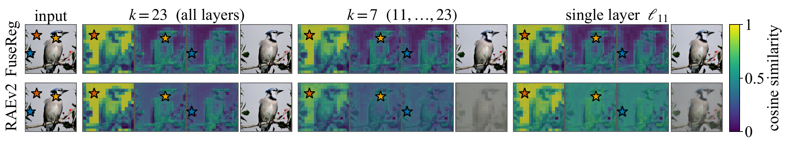
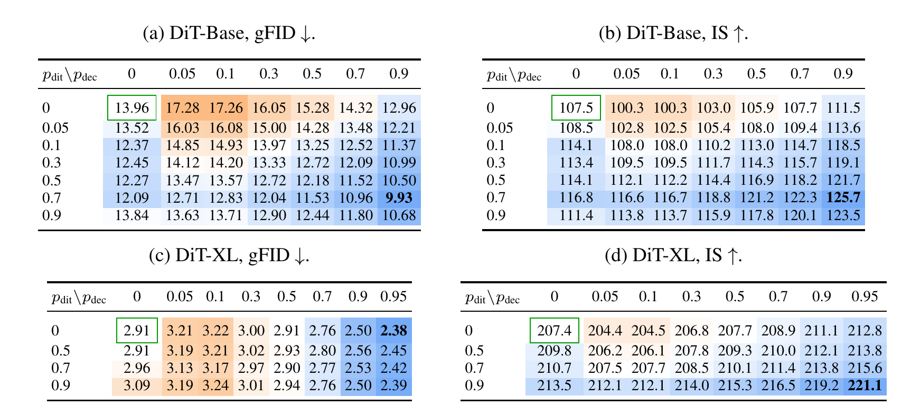
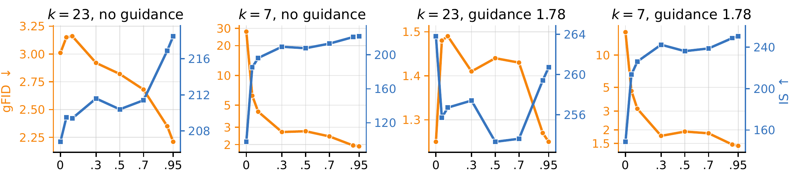
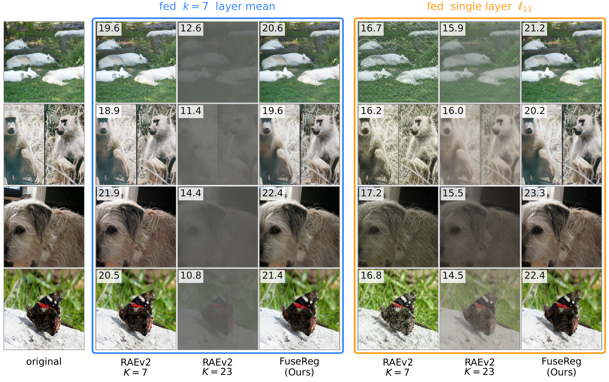
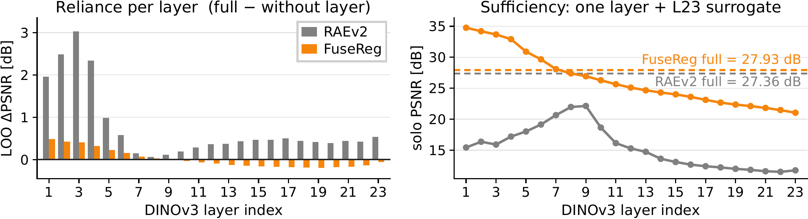

<div align="center">

# FuseReg: Regularizing Layer Fusion Mitigates the Reconstruction–Generation Gap in Representation Autoencoders

<p>
  <a href="https://hongyang-du.github.io/">Hongyang Du</a><sup>1,2</sup> &nbsp;&nbsp; <a href="https://yunfeixie233.github.io/">Yunfei Xie</a><sup>3</sup> &nbsp;&nbsp; <a href="https://junjieye.com/">Junjie Ye</a><sup>1</sup> &nbsp;&nbsp; <a href="https://jiawei-yang.github.io/">Jiawei Yang</a><sup>1</sup> &nbsp;&nbsp; <a href="https://oliver-cong02.github.io/">Xiaoyan Cong</a><sup>2</sup> &nbsp;&nbsp; <a href="https://cs.brown.edu/people/grad/hzhan351/">Haodong Zhang</a><sup>2</sup><br>
  <a href="https://www.abdn.ac.uk/people/yongchao.huang">Yongchao Huang</a><sup>4</sup> &nbsp;&nbsp; <a href="https://haiyuwu.github.io/">Haiyu Wu</a><sup>5</sup> &nbsp;&nbsp; <a href="https://zli12321.github.io/">Zongxia Li</a><sup>6</sup> &nbsp;&nbsp; <a href="https://www.linkedin.com/in/shihang-gui-06917727b/">Shihang Gui</a><sup>2</sup> &nbsp;&nbsp; <a href="https://davidliuk.github.io/">Dawei Liu</a><sup>7</sup> &nbsp;&nbsp; <a href="https://www.linkedin.com/in/runhao-li-lee021004/">Runhao Li</a><sup>1</sup><br>
  <a href="https://jingchengni.com/">Jingcheng Ni</a><sup>2</sup> &nbsp;&nbsp; <a href="https://weichen582.github.io/">Chen Wei</a><sup>3,†</sup> &nbsp;&nbsp; <a href="https://randallbalestriero.github.io/">Randall Balestriero</a><sup>2,†</sup> &nbsp;&nbsp; <a href="https://yuewang.xyz/">Yue Wang</a><sup>1,†</sup>
</p>

<p>
  <sup>1</sup>USC PSI Lab &nbsp;&nbsp; <sup>2</sup>Brown University &nbsp;&nbsp; <sup>3</sup>Rice University &nbsp;&nbsp; <sup>4</sup>University of Aberdeen<br>
  <sup>5</sup>University of Notre Dame &nbsp;&nbsp; <sup>6</sup>University of Maryland, College Park &nbsp;&nbsp; <sup>7</sup>University of Pennsylvania<br>
  <sup>†</sup>Equal advising &nbsp;·&nbsp; Corresponding to <a href="mailto:hongyang_du@brown.edu">hongyang_du@brown.edu</a>
</p>

<p>
  <a href="https://hongyang-du.github.io/FuseReg/"></a>
  <a href="#"></a>
  <a href="https://huggingface.co/Hongyang-Du/FuseReg"></a>
</p>

</div>

<p align="center">
  
</p>

**One decoder, every fusion.** FuseReg (top) keeps stable spatial structure under *K*=23, *K*=7 and the single layer ℓ<sub>11</sub>; the fixed-fusion RAEv2 decoder (bottom) degrades away from its training fusion.

## Overview

Representation autoencoders ask one fused latent to serve two different goals: shallow encoder features preserve pixel detail, while deeper features tend to be easier to model generatively. A fixed layer fusion hard-codes this trade-off into both the decoder and the generator.

**FuseReg turns layer fusion from a fixed heuristic into a training distribution.** Each training sample averages a random non-empty subset of encoder layers; the released latent also retains a fixed final-layer token-mean surrogate. The decoder learns to reconstruct from changing layer compositions, and the diffusion transformer learns from noisy subset representations while targeting the full-layer fusion. Inference uses the full-layer mean by default, with **no architecture change or additional inference cost**.

Averaging over the retained layers keeps the deployment latent unchanged in expectation, so randomization varies only the directions along which encoder layers disagree. The two stages use separate rates, `p_dec` and `p_dit`.

> [!IMPORTANT]
> **Paper formulation vs. released implementation:** the manuscript conditions Bernoulli masks on retaining at least one layer. The checkpoint-compatible source instead repairs an all-dropped draw by retaining one uniformly selected layer. Both support every non-empty subset, but they assign different probabilities; at `K=23, p=.95`, about 30.7% of raw draws are empty before repair. Preserve the released behavior for checkpoint-compatible execution, and do not describe a retraining run as distribution-identical to the manuscript without resolving this difference.

## Results

### One regularizer, two stages, two scales

<p align="center">
  
</p>

**Two stages, two scales.** Unguided ImageNet-256. Regularizing both stages gives the best gFID: **13.96 → 9.93** on DiT-Base and **2.91 → 2.38** on DiT-XL, against the fixed-fusion baseline in the green box.

### Fixed generator, swapped decoders

<p align="center">
  
</p>

**Same generator, same latents.** Swapping in a regularized decoder alone lowers gFID from **3.01 → 2.21** at *k*=23 and from **27.73 → 1.92** at *k*=7.

### One decoder, different layer readouts

<p align="center">
  
</p>

**Reconstruction off the training fusion.** Fixed-fusion RAEv2 decoders break down; FuseReg does not. Insets show PSNR in dB.

## Discussion

### FuseReg distributes reconstruction across layers

<p align="center">
  
</p>

**Distributed reconstruction.** FuseReg has a flatter leave-one-layer-out profile (left) and stronger single-layer readouts (right), on 10,000 held-out ImageNet-256 images.

Because the encoder is frozen, this reflects the decoder's ability to recover information already available across depths: improving the readout of a fixed representation can improve generation even when the generator and sampled latents are unchanged.

## 1. Environment setup

Validated with **Python 3.11** on a **Linux CUDA machine** (package metadata supports 3.10–3.13).

```bash
git clone https://github.com/Hongyang-Du/FuseReg.git
cd FuseReg
python3.11 -m venv .venv
source .venv/bin/activate
python -m pip install -r requirements.txt   # installs torch==2.10.0, torchvision==0.25.0
python -m pip install '.[train]'             # pinned GMuon optimizer, needed for DiT training
```

If the default index does not match your CUDA runtime, install the same torch pair from the matching [PyTorch wheel index](https://pytorch.org/get-started/locally/) first (e.g. `--index-url https://download.pytorch.org/whl/cu128`), then install FuseReg.

**Checkpoints** (access-controlled on [Hugging Face](https://huggingface.co/Hongyang-Du/FuseReg); see the [checkpoint manifest](reproduction/checkpoints.json)):

```bash
hf auth login
hf download Hongyang-Du/FuseReg --local-dir checkpoints
python scripts/verify_checkpoints.py --root checkpoints
```

**External assets** (obtain under their own terms):

| Asset | Location |
|---|---|
| DINOv3-L encoder ([access](https://huggingface.co/facebook/dinov3-vitl16-pretrain-lvd1689m)) | `pretrained_models/encoders/dinov3/dinov3_vitl16_pretrain_lvd1689m-8aa4cbdd.pth` (or set `DINOV3_CKPT_DIR`) |
| DINO S/8 discriminator (decoder training only) | `pretrained_models/encoders/dino/dino_vit_small_patch8_224.pth` |
| ImageNet train | `data/imagenet/train/` (ImageFolder) or `data/imagenet/imagenet-latents-images/` (Arrow) |
| ImageNet-256 val | `data_eval/imagenet-256-val.npz` — RGB `uint8`, shape `[N, 256, 256, 3]` |

For offline clusters, set `DINOV3_REPO_DIR` to a local DINOv3 checkout containing `hubconf.py`. Check the eval archive header before loading any model:

```bash
python scripts/validate_image_archive.py data_eval/imagenet-256-val.npz --min-images 100
```

## 2. Train the decoder

One config per `p_dec` in [`configs/stage1/decoder`](configs/stage1/decoder) (`p00`, `p005`, `p01`, `p03`, `p05`, `p07`, `p09`, `p095`; 16 epochs):

```bash
torchrun --standalone --nproc_per_node=8 src/train_decoder.py \
  --config configs/stage1/decoder/dinov3-k23-p095.yaml \
  data.data_dir=data/imagenet \
  data.val_npz=data_eval/imagenet-256-val.npz \
  training.out_dir=outputs/decoder-p095 \
  loss.gan.disc_ckpt=pretrained_models/encoders/dino/dino_vit_small_patch8_224.pth \
  wandb.enabled=false
```

## 3. Train the DiT

One config per `p_dit` in [`configs/stage2/training`](configs/stage2/training) (DiT-Base: `p00`–`p09`; DiT-XL: `p00`, `p05`, `p07`, `p09`; 40 epochs). First compute latent statistics for the full-fusion readout, then train:

```bash
torchrun --standalone --nproc_per_node=1 src/compute_latent_stats.py \
  --config configs/stage2/training/dinov3-k23-fulltarget-p09-ditxl.yaml \
  --num-samples 50000 --batch 32 \
  --out checkpoints/latent_stats.pt \
  dataset.data_dir=data/imagenet \
  stage_1.params.stage1_ckpt_path=checkpoints/dinov3-vitl/decoder_k23/p0.95.safetensors

GRAD_ACCUM_OVERRIDE=8 torchrun --standalone --nproc_per_node=8 src/train.py \
  --config configs/stage2/training/dinov3-k23-fulltarget-p09-ditxl.yaml \
  --results-dir outputs/ditxl-p09 --precision bf16 \
  dataset.data_dir=data/imagenet \
  stage_1.params.stage1_ckpt_path=checkpoints/dinov3-vitl/decoder_k23/p0.95.safetensors \
  stage_1.params.normalization_stat_path=checkpoints/latent_stats.pt
```

The global batch is fixed at 1024 (micro-batch = `1024 / (world_size × GRAD_ACCUM_OVERRIDE)`); keep it when changing GPU count.

## 4. Reproducing the tables

`scripts/run_table.py` builds every evaluation command for a table from [the experiment matrix](reproduction/experiments.json), runs it and compares against the paper value. Add `--dry-run` to only print the commands. Reconstruction uses 50,000 ImageNet-256 images; generation uses 50,000 samples with 50 Euler steps. Rows with unmapped assets are skipped and reported, not approximated. See the [reproduction guide](docs/reproduction.md) for protocol details.

Table 1's baselines and Table 5's K7 generator are official RAEv2 checkpoints. Download them, then list the latent statistics each generator was trained with in `assets.json`:

```bash
hf download nyu-visionx/RAEv2-models \
  --include "stage1/imagenet/dinov3l-k7/*" "stage1/imagenet/dinov3l-k23/decoder.pt" "stage2/imagenet/dinov3l-k7/*" \
  --local-dir checkpoints/raev2-models

cat > assets.json <<'JSON'
{
  "latent_stats_k23": "checkpoints/latent_stats.pt",
  "latent_stats_k7": "checkpoints/raev2-models/stage1/imagenet/dinov3l-k7/stats.pt"
}
JSON
```

<details>
<summary><strong>Table 1</strong> · Reconstruction across fusions (k=7, k=23, ℓ11)</summary>

```bash
python scripts/run_table.py --table 1 \
  --val-npz data_eval/imagenet-256-val.npz --results-dir results/table1
```

All 9 rows. The official RAEv2 K7/K23 decoders always run with raw `[0, 1]` output, whatever `--decoder-output-normalization` says.

</details>

<details>
<summary><strong>Table 2</strong> · p<sub>dec</sub> × p<sub>dit</sub> grid, DiT-Base and DiT-XL, no guidance</summary>

```bash
python scripts/run_table.py --table 2 --bindings assets.json \
  --val-npz data_eval/imagenet-256-val.npz --results-dir results/table2
```

Runs the 32 DiT-XL cells (same as the unguided half of Table 6). The 49 DiT-Base cells are skipped: the DiT-Base generators are not in the checkpoint manifest yet.

</details>

<details>
<summary><strong>Table 4</strong> (appendix) · Decoder drop-rate sweep, 8 decoders × 3 readouts</summary>

```bash
python scripts/run_table.py --table 4 --decoder-output-normalization encoder \
  --val-npz data_eval/imagenet-256-val.npz --results-dir results/table4
```

All 24 rows. `--decoder-output-normalization` is required for the p<sub>dec</sub>=0 decoder (its checkpoint does not record it); without it those 3 rows are skipped.

</details>

<details>
<summary><strong>Table 5</strong> (appendix) · Fixed generator, swapped decoders, with/without guidance</summary>

```bash
python scripts/run_table.py --table 5 --bindings assets.json --decoder-output-normalization encoder \
  --val-npz data_eval/imagenet-256-val.npz --results-dir results/table5
```

All 32 rows. Use `--bindings`, not `--latent-stats`: the K7 and K23 columns need different statistics.

</details>

<details>
<summary><strong>Table 6</strong> (appendix) · DiT-XL rates, 4 generators × 8 decoders × 2 guidance settings</summary>

```bash
python scripts/run_table.py --table 6 --bindings assets.json --decoder-output-normalization encoder \
  --val-npz data_eval/imagenet-256-val.npz --results-dir results/table6
```

All 64 rows.

</details>

## License

See [LICENSE](LICENSE) for the repository's inherited code license and [THIRD_PARTY_NOTICE.md](THIRD_PARTY_NOTICE.md) for upstream attribution. Paper figures/PDF, released checkpoints, DINO weights and ImageNet data may have separate terms; users are responsible for following the terms attached to each asset.

## Citation

Provisional project citation; replace it with the stable venue/arXiv entry when one is available.

```bibtex
@misc{du2026fusereg,
  title  = {FuseReg: Regularizing Layer Fusion Mitigates the Reconstruction-Generation Gap in Representation Autoencoders},
  author = {Du, Hongyang and Xie, Yunfei and Ye, Junjie and Yang, Jiawei and Cong, Xiaoyan
            and Zhang, Haodong and Huang, Yongchao and Wu, Haiyu and Li, Zongxia
            and Gui, Shihang and Liu, Dawei and Li, Runhao and Ni, Jingcheng
            and Wei, Chen and Balestriero, Randall and Wang, Yue},
  year   = {2026},
  url    = {https://hongyang-du.github.io/FuseReg/}
}
```
